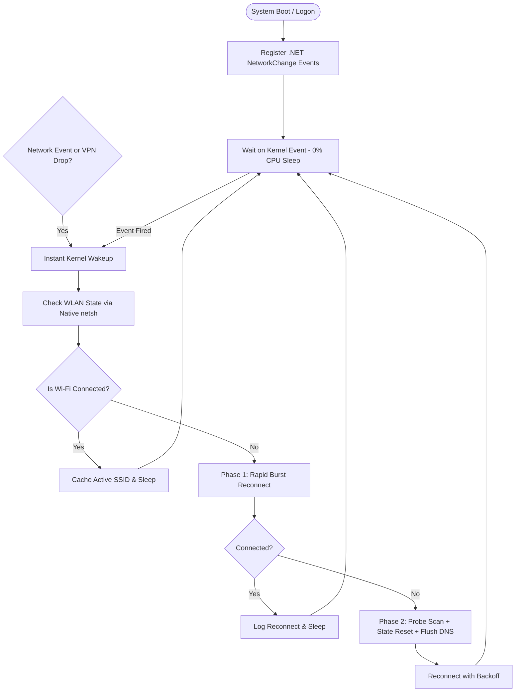

# 📶 Windows Wi-Fi Auto-Reconnect Service

[](https://microsoft.com)
[](https://github.com/PowerShell/PowerShell)
[](LICENSE)
[](https://github.com/RMNO21/wifi-auto-reconnect)
[](https://github.com/RMNO21/wifi-auto-reconnect)

> **سرویس هوشمند، فوق‌کم‌مصرف و رویدادمحور (Event-Driven) برای اتصال مجدد آنی و خودکار به وای‌فای در ویندوز — مقاوم در برابر قطع ناگهانی VPN، تغییر شبکه و اسلیپ سیستم.**

An ultra-low-power, event-driven background service for Windows that monitors Wi-Fi connection states and instantly re-associates with your preferred wireless network. Specially designed to resolve drops caused by **VPN disconnections (TUN/TAP/DCO)**, router blips, or sleep/wake transitions with **zero CPU usage**.

---

## 🚀 Key Features | ویژگی‌های کلیدی

* ⚡ **Instant Event-Driven Wakeup (Zero Lag):**
  Instead of wasteful polling loops, it listens directly to `.NET NetworkChange` kernel events (`NetworkAvailabilityChanged` & `NetworkAddressChanged`), waking up within milliseconds when connection drops.
* 🛡️ **VPN Disconnect Resilience:**
  Specifically solves the issue where turning off VPNs (ExpressVPN, OpenVPN DCO, WireGuard, TUN modes) causes NDIS filter driver shocks or IP resets that drop the physical Wi-Fi connection. Includes automatic connection cycling and DNS cache flush.
* 🔋 **Ultra-Low Resource Consumption:**
  Sleeps deeply on an OS kernel wait handle (`System.Threading.AutoResetEvent`). Near **0% CPU** and virtually **0% battery drain**.
* 🎯 **Preferred Network Retention:**
  Remembers your active SSID/profile and never connects to unauthorized or unknown networks.
* 👻 **Ghost Adapter Immunity:**
  Accurately identifies the primary physical Wi-Fi hardware (`netsh wlan`) while ignoring phantom or disabled adapters (`Wi-Fi 2`, `Wi-Fi 4`, virtual miniports).
* 🔄 **Single-Instance Mutex Protection:**
  Guaranteed single running background instance via Windows Global Mutex.
* 🔇 **Completely Invisible (Silent Background):**
  Launches via VBScript wrapper with `-WindowStyle Hidden` — no black terminal popups or intrusive consoles.

---

## 🛠️ Quick Installation | راهنمای نصب سریع

### روش ۱: نصب خودکار با یک کلیک (توصیه شده)
1. مخزن را دانلود یا کلون کنید:
   ```cmd
   git clone https://github.com/RMNO21/wifi-auto-reconnect.git
   cd wifi-auto-reconnect
   ```
2. روی فایل **`install.bat`** راست‌کلیک کرده و اجرا کنید (یا در ترمینال PowerShell فایل `.\install.ps1` را اجرا کنید).

اسکریپت نصب به صورت خودکار:
- فایل‌ها را در مسیر استاندارد `%LOCALAPPDATA%\WiFiAutoReconnect` مستقر می‌کند.
- تسک زمان‌بندی‌شده‌ی سیستمی ویندوز (`WiFi-Auto-Reconnect`) را می‌سازد تا همواره در بالا آمدن ویندوز (Logon) در پس‌زمینه اجرا شود.
- سرویس را بلافاصله فعال می‌کند.

---

## 📂 Project Structure | ساختار پروژه

```
wifi-auto-reconnect/
├── scripts/
│   ├── wifi_reconnect.ps1    # Core event-driven reconnect monitor
│   └── wifi_hidden.vbs       # Zero-window background launcher
├── install.ps1               # Automated installation & Task Scheduler setup
├── install.bat               # 1-click installer launcher
├── uninstall.ps1             # Clean removal script
├── uninstall.bat             # 1-click uninstaller launcher
├── .gitignore
├── LICENSE                   # MIT License
└── README.md
```

---

## ⚙️ How It Works | نحوه کارکرد فنی



---

## 📊 Logs & Monitoring | مشاهده لاگ‌ها

فایل لاگ فعالیت‌ها در مسیر زیر ذخیره و به طور خودکار فشرده‌سازی و مدیریت می‌شود (حداکثر ۶۴ کیلوبایت):
```
%LOCALAPPDATA%\WiFiAutoReconnect\wifi_reconnect_log.txt
```

برای مشاهده زنده لاگ در PowerShell:
```powershell
Get-Content "$env:LOCALAPPDATA\WiFiAutoReconnect\wifi_reconnect_log.txt" -Tail 20 -Wait
```

---

## 🗑️ Uninstallation | حذف سرویس

برای غیرفعال‌سازی و حذف کامل سرویس:
- کافیست فایل **`uninstall.bat`** را اجرا کنید (یا در PowerShell دستور `.\uninstall.ps1` را بزنید).
- این دستور تسک زمان‌بندی‌شده و تمامی پروسه‌های در حال اجرا را متوقف و حذف می‌کند.

---

## 📄 License

This project is licensed under the [MIT License](LICENSE).
Copyright (c) 2026 RMNO21.
